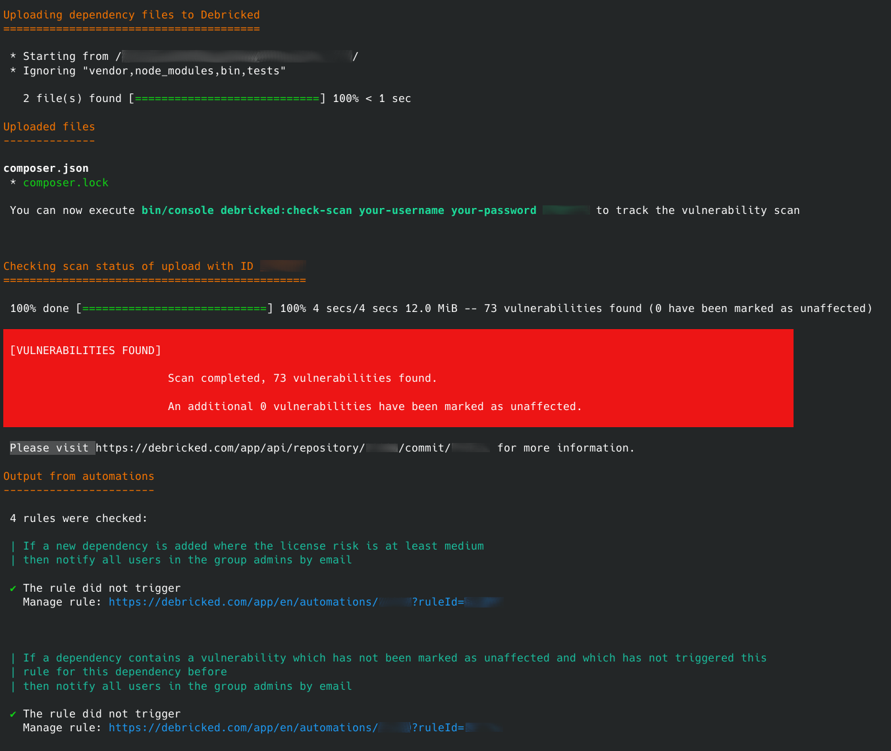

# debricked-cli
[](https://travis-ci.org/debricked/debricked-cli)
[](https://packagist.org/packages/debricked/cli)



Command Line Tool (CLI) for interacting with [Debricked](https://debricked.com). Supports uploading and checking your dependency files for vulnerabilities.

## Documentation
Head over to our [Integration documentation page](https://debricked.com/knowledge-base/articles/integrations/#debricked-cli) for the main source of documentation.

To run the tool using only Docker, instead of a local install, use it as below,
where the current directory is assumed to contain the project you wish to scan.

```
docker run -it --rm -v $PWD:/data:ro debricked/debricked-cli <command>
```

A practical example of scanning a local repository in your current working directory:

```
docker run -it --rm -v $PWD:/data:ro debricked/debricked-cli debricked:scan user@example.com password myproject myrelease null cli
```

## Code contributions

### Build image for running the tool

To build the cli tool for running

```
docker build -t debricked/debricked-cli .
```

### Run tests
All contributions are greatly welcome! To help you get started we have a included a
Dockerfile which provides a environment capable of running the whole CLI application
and related tests.

#### Prerequisites
- [Docker](https://docs.docker.com/install/)

#### Configure and run test environment
1. Create a .env.test.local file in the root directory (alongside this README) containing:
```text
DEBRICKED_USERNAME=your debricked username
DEBRICKED_PASSWORD=your debricked password
```
2. Run tests! You can now run the tests locally by executing `./localTest.sh` in your terminal.

### Best practises
We try to follow Symfony's best practises as much as possible when developing. You can read more about them here
https://symfony.com/doc/current/best_practices/business-logic.html
